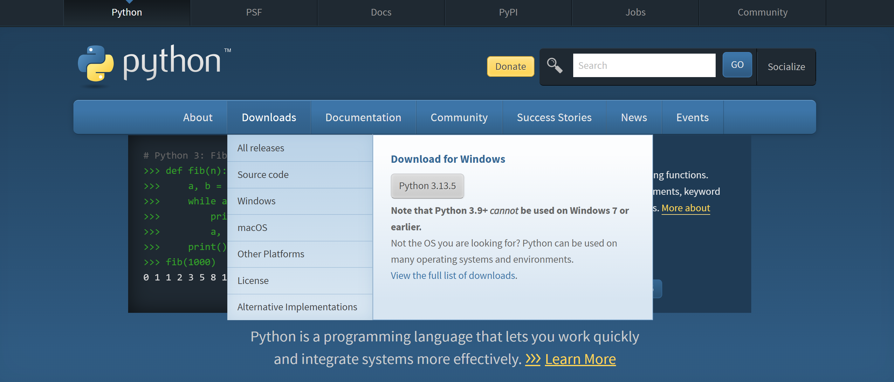
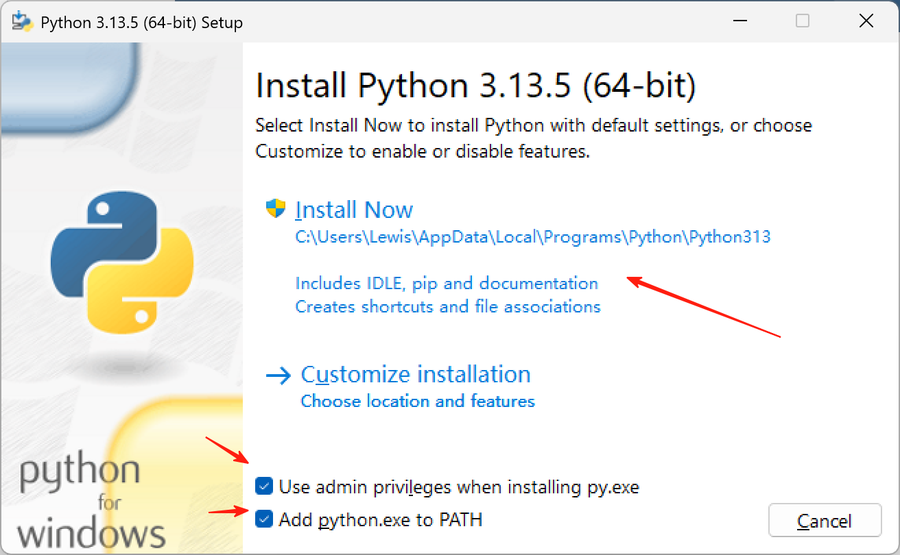
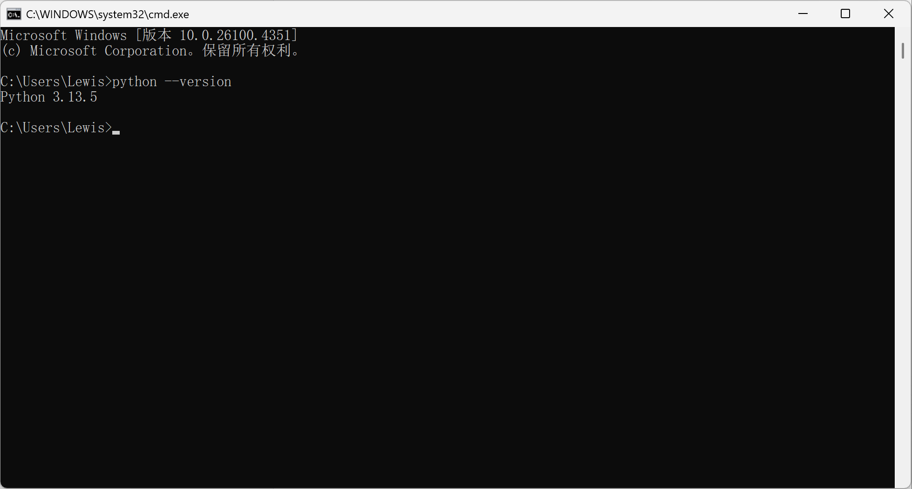
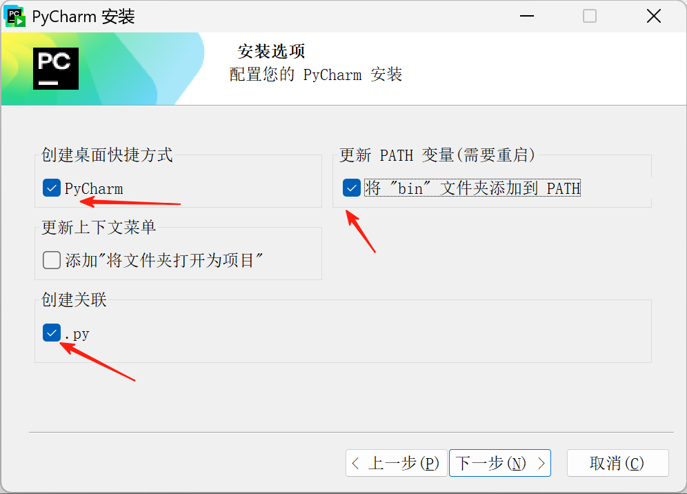
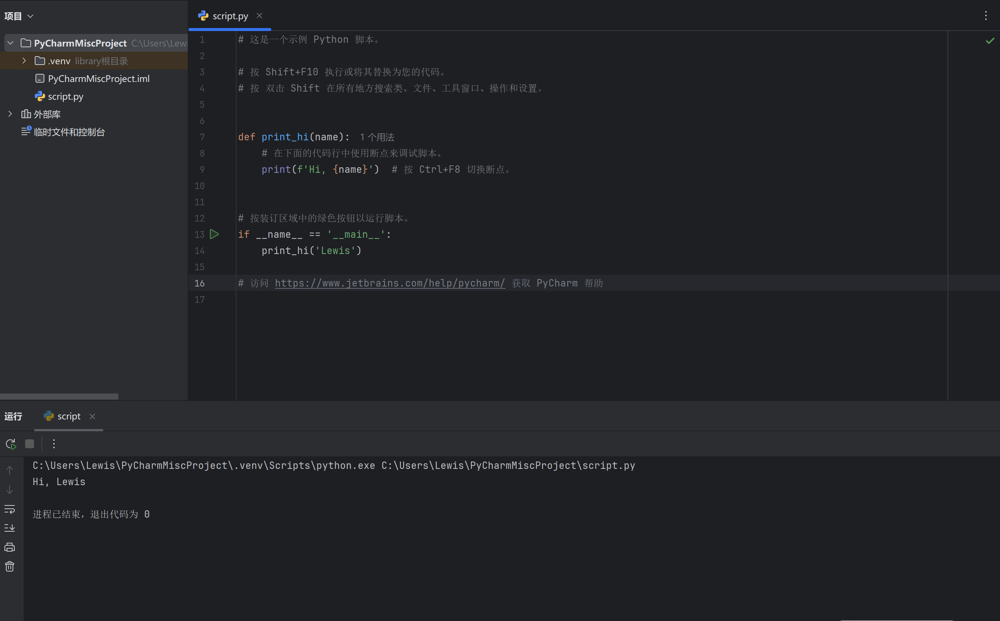

# Python 安装与环境配置指南

## Windows 系统安装 Python

### 1. 下载 Python

- 访问 Python 官网：[Download Python | Python.org](https://www.python.org/downloads/)
- 点击下载最新版本（默认会下载适合你系统的版本）
- 如需特定版本，可在 Downloads 中选择 Windows 版本



### 2. 安装 Python

**推荐安装方式：**

1. 运行下载的安装包
2. 勾选以下两项：
   - "Install launcher for all users (recommended)"
   - "**Add Python to PATH**"（非常重要）
3. 点击 "Install Now" 进行默认安装



**自定义安装选项：**

- Documentation：Python 文档和帮助文件
- pip：Python 包管理工具（必选）
- tcl/tk and IDLE：图形界面和 Python 自带 IDE
- Python test suite：测试套件（新手可不选）
- py launcher：为所有用户安装 Python 启动器

### 3. 环境配置

如果安装时**勾选**了 "Add Python to PATH"，则无需额外配置。否则需要：

1. 打开系统属性 → 高级系统设置 → 环境变量
2. 在系统变量的 Path 中添加 Python 安装路径（如：`C:\Users\用户名\AppData\Local\Programs\Python\Python312\`）

### 4. 测试安装

打开命令行(cmd)，输入：

```bash title="bash"
python --version
```

应显示安装的 Python 版本号。



## Mac 系统安装 Python

Mac 系统通常自带 Python 2.x，建议安装最新版本：

1. 打开终端(Terminal)
2. 输入 `python3` 检查是否已安装 Python 3.x
3. 如需安装，可访问 [Python for Mac](https://www.python.org/downloads/mac-osx/) 下载安装包

## IDE 安装与使用（PyCharm）

### 1. 下载 PyCharm

- 官网：[PyCharm](https://www.jetbrains.com/pycharm/)
- 推荐下载 Professional 版（学生可免费使用）

### 2. 安装 PyCharm

1. 运行安装程序
2. 选择安装路径
3. 建议勾选：
   - 创建桌面快捷方式
   - 更新 PATH 变量
   - 创建文件关联



### 3. 使用 PyCharm

1. 创建新项目
2. 新建 Python 文件
3. 编写简单代码测试：

```python title="测试"
print("Hello World")
```

4. 点击运行按钮执行程序



## 常见问题

1. **用户变量 vs 系统变量**：
   - 用户变量：仅对当前用户有效
   - 系统变量：对所有用户有效

2. **PyCharm 社区版 vs 专业版**：
   - 社区版：免费，基础功能
   - 专业版：收费，支持更多高级功能（如科学计算、Web 开发等）

3. **Python 版本选择**：
   - 新手建议安装最新稳定版
   - 特定项目可能需要特定版本

## 参考链接

1. [Python安装与环境配置全程详细教学（包含Windows版和Mac版）\_python环境-CSDN博客](https://blog.csdn.net/sensen_kiss/article/details/141940274)
2. [Python 环境搭建 | 菜鸟教程](https://www.runoob.com/python/python-install.html)
